# Shangri La Main Quest Guide

## Recommended setup:
* Immolation Liquidation

## Note:
* Need four players
* Start hitting box right away for the baby maker
* Go into eclipse mode by having all four players in spawn interact with the buttons on the wall at the same time.\
\
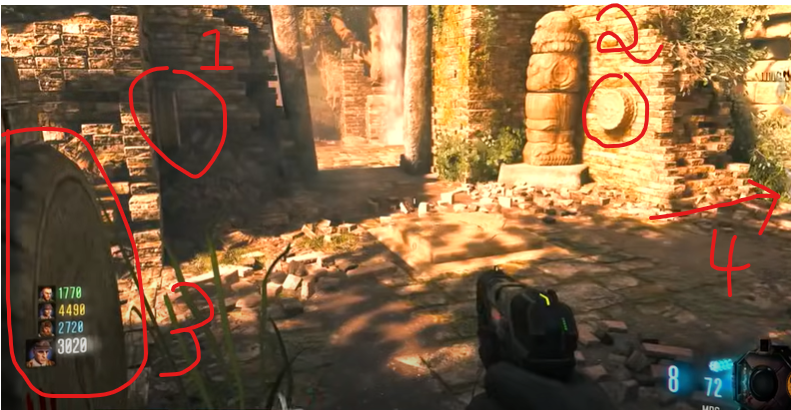\
\
Every step besides step 1 must be done in eclipse mode unless otherwise stated.

## Steps

### Step 1:
Turn on power.

### Step 2:
Go down to the room next to spawn, the area with the railcart in it. Down by the pharo/mpl wall buy there is a button to press.\
\
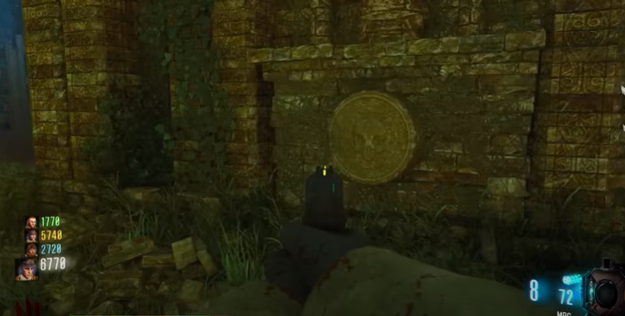\
\
Interact with it and listen to Brock and Gary. 12 stone slabs will spawn on either side of the spawn room.\
\
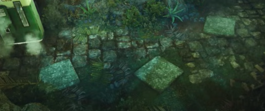\
\
 There will be three roles for this step. A trainer to train the last zombie, a caller, and two seekers. When a player stands on a stone slab a symbol will appear, there are 12 symbols one on each side of the spawn room. In order to complete this step players must stand on the matching slabs without running out of time during the eclipse and without standing on an inccorect pair at the same time. The caller will be on one side of spawn while the seekers will be on the other side. The caller will stand on a slab, call out what the symbol is, and then stand off and wait. The seekers will stand on the slabs on their side until they find the called symbol. Then the seeker and the caller will stand on the matching slabs, those two slabs will sink into the ground. Once done the caller will move on to the next slab and repeat until all 12 are done. Players can refer to discord for a chart with all symbols.\
 \
 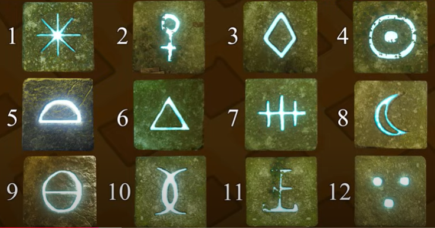\
 \
 Brock and gary will start talking, and then eclipse will end when complete. If eclipse ends before the step is complete, go back into eclipse and start again.

 ### Step 3:
 Have three players standing on the metal grate you land on when taking the water slide. Make sure not to move when down there. The fourth player will slide down the water slide holding interact while going down trying to stay on the right side in order to hit a switch. When the forth player lands at the bootom, everyone should stand still and wait until the eclipse ends so you know that you have done it correctly.

 ### Step 4:
 At the top of the water slide, use an explosive to knock down a crystal that is above the slide.\
 \
 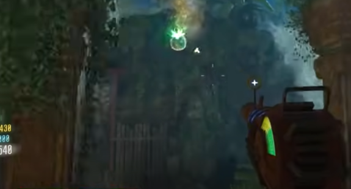\
 \
Shrink it with the baby maker, then melee it towards the water slide. It will land on the shute, take the shute and it will end up here:\
\
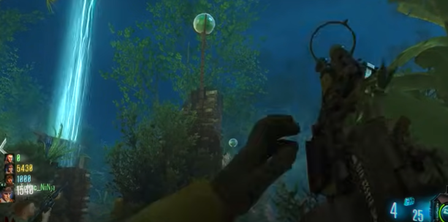\
\
The eclipse will end.

### Step 5:
When a napalm zombie spawns DONT KILL IT and go into eclipse. Bring the napalm into the minecart side tunnel. In that tunnel spin this wheel four times:\
\
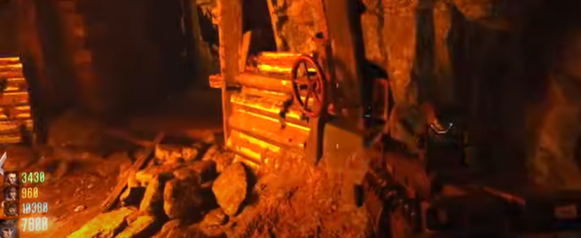\
\
It will turn on the gas in the pipes which you can see here:\
\
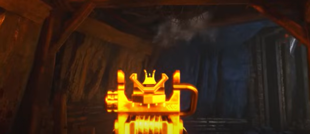\
\
You need to walk the napalm zombie by this spot and three other locations to ignite the gas.\
\
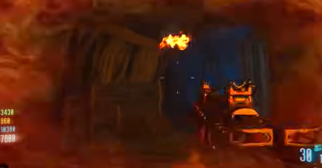\

#### The other three locations:
Above box just past the tunnel:\
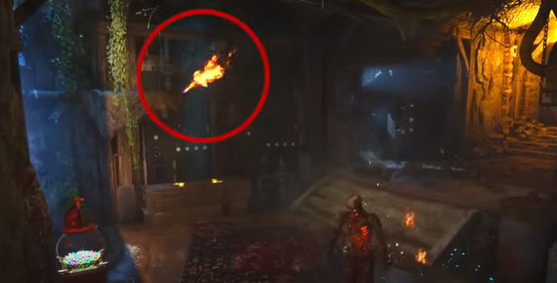\
\
Above perk location:\
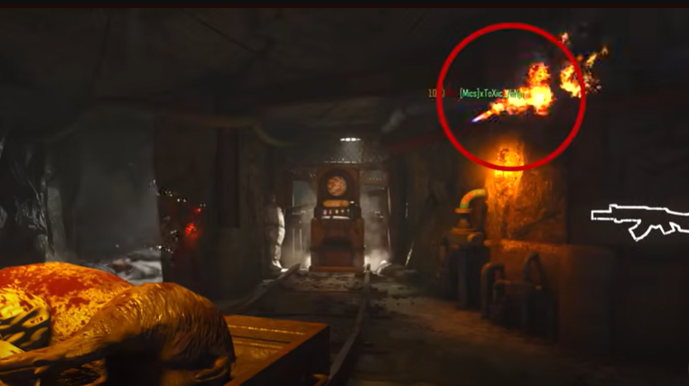\
\
Just past last location above the stairs:\
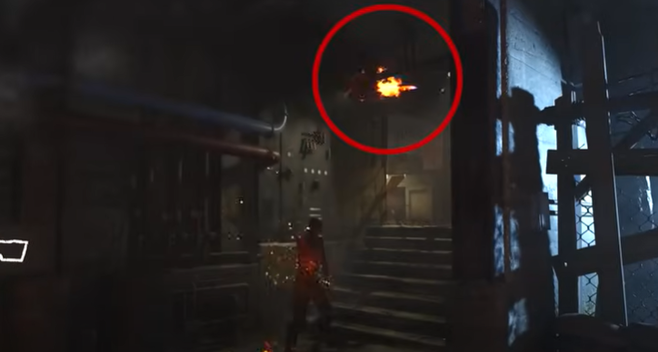\
\
Once all four are ignighted, go back to where the wheel was and interact with the lever.\
\
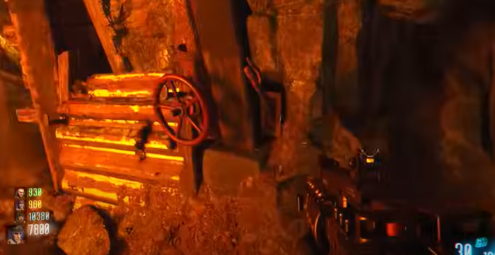\
\
Brock and Gary will talk and eclipse will end.

### Step 6:
Go to the waterfall side tunnel. In the wall there will be four holes. Place tripmines on the floor in front of all four holes and have zombies trip them.\
\
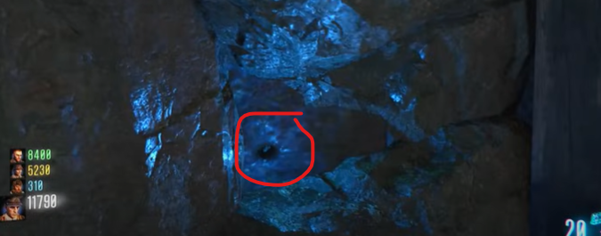\
\
Hit the button at the bottom of the waterfall that activates the trap.\
\
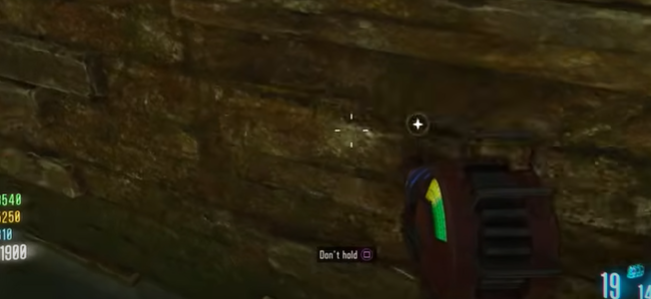\
\
The eclipse will end.

### Step 7:
There are 12 stone slabs in the walls that need to be melee'd. There are two up by the minecart, five in the spawn room, two by the mudpit, two in the room just past the bottom of the waterfall, and one right next to the power switch. Go to the minecart area, just outside the map there is a wooden ensemble that needs to be blown up via grenade.\
\
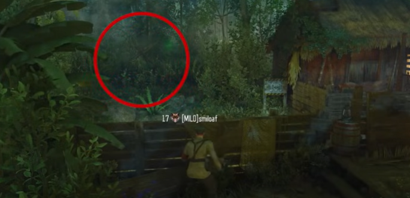\
\
Eclipse will end.

### Step 8:
This timed step wll require the players to spin four wheels in such a manner that specific symbols are at the top of the wheel. The wheels are in each corner of the mud room. The wheel to the left when coming into the mud room from spawn should have the four dots symbol ontop. The wheel 180 degrees from the previous wheel should have the three dots symbol on top. The wheel in the corner to the right of that previous one will have the 'cl.' symbol on top. The final wheel 180 degrees from the last one will have the single dot symbol on top. The eclipse will end.

### Step 9:
The pack-a-punched baby maker is required at this point. Each player needs to find a gong that the in game character likes. The character will have a quote that sounds like they are happy when the 'good gong' is meele'd. When a player finds one wait for the other players to find one. Once all four have found a 'good gong' they should all meele them. There are eight gong locations all in or next to spawn. Once meele'd properly the crytal balls will start to glow, the player with the baby maker needs to stand in this spot:\
\
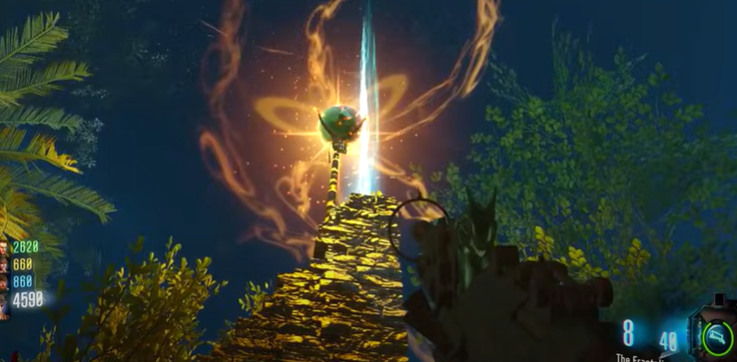\
\
and shoot the crystal. A stick of tnt will fall onto the player. The spot is just past the spike traps on the way to the minecart. Go into spawn and stand in this spot:\
\
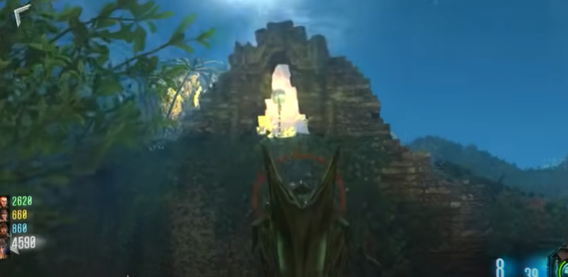\
\
and shoot the crystal with the baby maker. This spot is in front of the stairs to pack-a-punch. This will shrink the meteor above the pack-a-punch. Go up to it, listen to Brock and Gary. Interact with the wall and give them the tnt, back away. Go back up once the explosion goes off, pick up the shrinked meteor.

### Step 10:
OH YEAHHHHH!!!! gg
